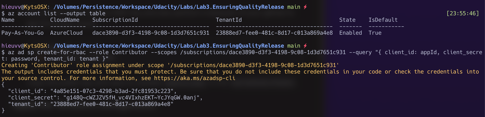

# Table of Contents - Ensuring Quality Releases

- **[Overview](#Overview)**
- **[Dependencies](#Dependencies)**
- **[Azure Resources](#Azure-Resources)**
- **[Installation Configuration Steps](#Installation-Configuration-Steps)**
- **[Monitoring And Logging Result](#Monitoring-And-Logging-Result)**
- **[Clean Up](#Clean-Up)**

## Overview

This project desmostrates the workflow for realease quality ensuring using Azure cloud. This will implement automated testing, performance monitoring, loggin using Azure DevOps, JMeter, Selenium, Postman and Terraform.

<!-- TODO: Add intro picture -->


## Dependencies
| Dependency   | Link                                                                 |
| ------------ | -------------------------------------------------------------------- |
| Terraform    | https://www.terraform.io/downloads.html                              |
| JMeter       | https://jmeter.apache.org/download_jmeter.cgi                        |
| Postman      | https://www.postman.com/downloads/                                   |
| Python       | https://www.python.org/downloads/                                    |
| Selenium     | https://sites.google.com/a/chromium.org/chromedriver/getting-started |
| Azure DevOps | https://azure.microsoft.com/en-us/services/devops/                   |

## Azure Resources
 - Azure account  
 - Azure Storage account (resource)
 - Azure Log Workspace (resource)
 - Terraform Service principle (resource)
 - Azure CLI (resource)

## Installation Configuration Steps

### Terraform in Azure
1. Clone source repo
2. Open a Terminal in VS Code and connect to your Azure Account and get the Subscription ID

    ```bash
    az login 
    az account list --output table
    ```

3. Configure storage account to Store Terraform state
   
   Execute the script **terraform/environments/test/configure-tfstate-storage-account.sh** :
   
   ```bash
   ./terraform/environments/test/configure-tfstate-storage-account.sh
   ```

   

   The resource group and storage account will be created on Azure cloud. 

   
   
   
   Take notes of `storage_account_name`, `container_name`, `access_key` . They are will be used in `main.tf` terrafrom files

    ```terraform
    terraform {
        backend "azurerm" {
            storage_account_name = "hieuvvstorage1999"
            container_name       = "hieuvvcontainer1999"
            key                  = "test.terraform.tfstate"
            access_key           = "wEef3qU/SXyP8D+sgeZwD28vXTkLbAtmIwMjT/DW7IiLbsbblJrwG9+t3wrFFEAm32vh2CCOOpF++AStbdZd7w=="
        }
    }
    ```
    
    


#### Create a Service Principal for Terraform

1. Create a Service Principal with **Contributor** role, performing the following steps:

    ```bash
    az ad sp create-for-rbac --role Contributor --scopes /subscriptions/<your-subscription-id> --query "{ client_id: appId, client_secret: password, tenant_id: tenant }" 
    ```

    

    Take notes of `appId`, `password`, and `tenant` as will be used at `terraform/environments/test/terraform.tfvars` file 

2. On your terminal create a SSH key and also perform a keyscan of your github to get the known hosts.

    ```bash
    ssh-keygen -t rsa
    cat ~/.ssh/id_rsa.pub
    ```

    Copy the public key and save to variable `public_key` in the `terraform.tfvars`.

#### Apply the Terraform configuration

  ```bash
  cd terraform/environments/test
  terraform init #terraform init -reconfigure
  terraform plan -out solution.plan
  terraform apply
  ```

  All the Terraform resources will be created on Azure cloud.

  

### Azure DevOps

You need an Azure DevOps account and then follow these steps to setup the Pipelines.

#### 1. Install AzureDevOps Extensions:

  * [JMeter](https://marketplace.visualstudio.com/items?itemName=AlexandreGattiker.jmeter-tasks&targetId=625be685-7d04-4b91-8e92-0a3f91f6c3ac&utm_source=vstsproduct&utm_medium=ExtHubManageList)

  * [PublishHTMLReports](https://marketplace.visualstudio.com/items?itemName=LakshayKaushik.PublishHTMLReports&targetId=625be685-7d04-4b91-8e92-0a3f91f6c3ac&utm_source=vstsproduct&utm_medium=ExtHubManageList)

  * [Terraform](https://marketplace.visualstudio.com/items?itemName=ms-devlabs.custom-terraform-tasks&targetId=625be685-7d04-4b91-8e92-0a3f91f6c3ac&utm_source=vstsproduct&utm_medium=ExtHubManageList)

#### 2. Create a Project in your Organization

Click into your Organization > New Project

#### 3. Create the Service Connection

In Project Settings > Pipelines > Service Connection > Create service connection

1. Select Azure Resource Manager
2. Select Service principal (automatic)
3. Select Scope level: Subscription
4. Login into your Azure account
5. Select your subscription
6. Select your Resource group
7. Enter service connection name
8. **Check: Grant access permission to all pipelines**
9. Click Save


#### 4. Add Library Sercure Files

In Pipelines > Library > Secure files

  * The ssh private key file : `id_rsa`
  * The terraform tfvars file : `terraform.tfvars`
  
  

#### 5. Update azure-pipelines.yaml

Get your "Known Hosts Entry" is the displayed third value that doesn't begin with # in the GitBash results:<br/>
    
```bash
ssh-keyscan github.com
```

Take note value in highlight below to fill `knownHostsEntry`


| # # | parameter          | description                                                   |
| --- | ------------------ | ------------------------------------------------------------- |
| 1   | knownHostsEntry    | the knownHost of your ssh-keyscan github                      |
| 2   | sshPublicKey       | your public ssh key (from id_rsa.pub)                         |
| 3   | storageAccountName | Value from Configure storage account to Store Terraform state |

#### 6. Create groups of variables

Create groups of variables that you can share across multiple pipelines.

1. In Pipelines > Library > "Variable groups" > Add new variables group: `ssh-config`.
2. Add `knownHostsEntry`, `sshPublicKey`, `StorageAccountName` and value this in Variables > Select type to secret > Save


#### 7. Create a New Pipeline in your Azure DevOPs Project

Make sure your GitHub repository has **azure-pipelines.yaml** file.

##### 7.1. Create Pipelines

1. Tab Pipelines
2. Click Create Pipeline
3. Where is your code? Choose Github (Yaml)
4. Select your Repository
5. Login GitHub account and grant access for Azure DevOps
6. Configure your pipeline:
   1. Choose "Existing Azure Pipelines yaml file"
   2. Continue
   3. Run


##### 7.2. Apcept permission for Azure Resources Create with terraform

  

  

##### 7.3. Registration VM on environment Pipeline

When step deploy virtual machine(VM) if you can see error : "No resource found ...". you must Registration VM on environment Pipeline and you only need to run it once (from 8.4 to 8.6)


8.4. Go to Azure pipeline -> Environments -> you can see Environments name is "TEST" -> Choose and select "Add resource" -> choose "Virtual machines" > Select "Linux" and Choose icon "Copy command ..." > Close <br>
Something similar to </br>
   </br>
  

8.5. SSH into the VM created using the Public IP -> Enter command you just copy above step -> Run it -> Success if you see result like this 
 <br>
  


Get at the end a result like:


8.6. Back to pipeline and re-run

